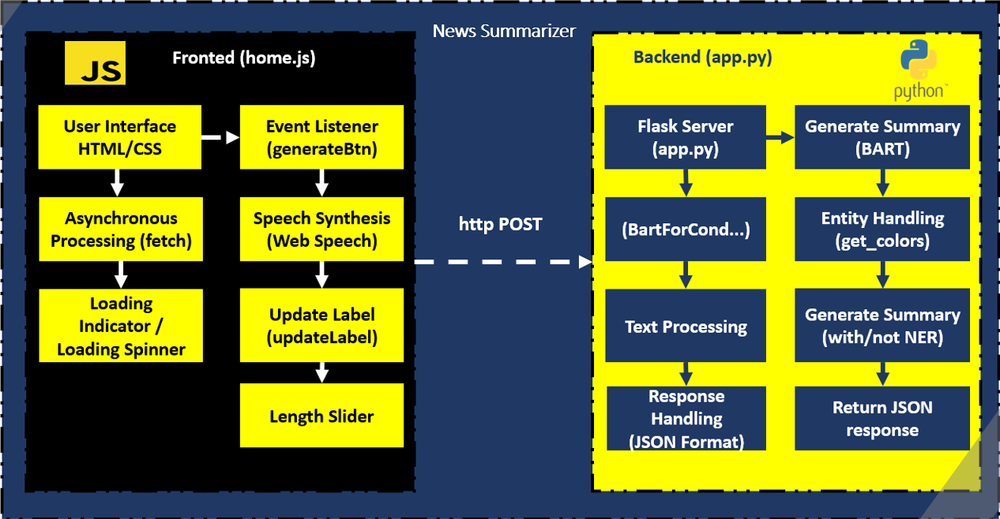
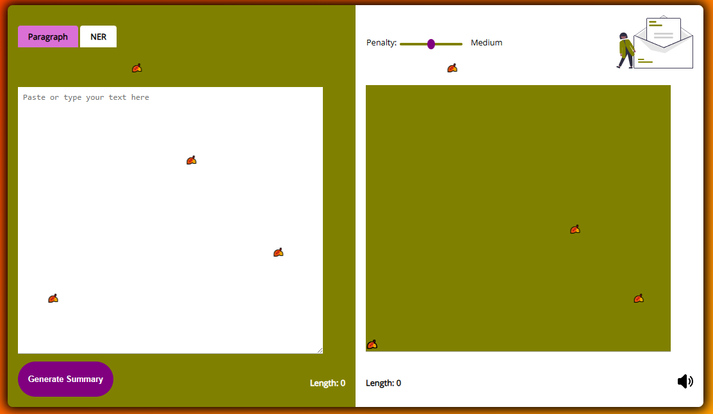

<div style="background-color:olive; color:white; font-size:15px; font-family:Comic Sans MS; padding:10px;font-weight:bold;border-radius: 20px;border: 5px solid black;">
<p style="color:cyan;font-weight:bold"><u>Réalisé par:</u></p>
<ul >
    <li>ELGHAZI Soufiane</li>
</ul>
    
</div><br>

<h1 style='color:#4c4893' align='center'>
    Text mining : News Summarizer application
</h1>


<div style="background-color:white; color:black; font-size:15px; font-family:Comic Sans MS; padding:10px; border: 5px solid black;font-weight:bold;border-radius: 20px;">
De nos jours, l'essor des réseaux sociaux, tels qu'Instagram, a ouvert de nouvelles perspectives de communication et d'information. Cependant, la transparence de ces plateformes est devenue une préoccupation majeure, en particulier lorsqu'il s'agit de sujets sensibles tels que la situation en Palestine. Des observations révèlent que des contenus relatifs à cette région sont souvent censurés, masquant ainsi des aspects cruciaux de la réalité.
C'est dans ce contexte que notre application se distingue, s'érigeant comme un moyen innovant de contrecarrer cette opacité. Plutôt que de se plier à la tendance à la suppression de contenus, notre application a pour mission de donner aux utilisateurs un accès direct à l'information, en particulier à travers des articles de presse approfondis. Conscients du temps limité de nos utilisateurs et de la complexité parfois décourageante des articles journalistiques, notre application intervient en simplifiant ce processus. Nous prenons des articles de news, souvent longs et détaillés, et les résumons de manière à fournir des points essentiels, permettant ainsi à chacun de rester informé de manière concise et efficace.

En substance, notre application vise à combler le fossé entre l'information exhaustive et la facilité d'accès, en offrant un moyen transparent et impartial d'aborder des sujets cruciaux, tout en encourageant une compréhension plus profonde et nuancée du monde qui nous entoure.
</div><br>

<div style="background-color:white; color:black; font-size:15px; font-family:Comic Sans MS; padding:10px; border: 5px solid black;font-weight:bold;border-radius: 20px;">
Dans ce Répértoir vous allez trouver les éléments suivants:
<ul>
    <li><span style="color:purple">Summary_app:</span><span style="color:olive">Ce dossier contient le code de l'application</span></li>
    <li><span style="color:purple">Data:</span><span style="color:olive">Ce dossier contient l'ensemble des données scrapées et celle d'enrechissement ainsi que les données nettoyée</span></li>
    <li><span style="color:purple">Notebooks :</span><span style="color:olive">Contient les notebooks des modèles , scraping et nettoyage des données</span></li>
    <li><span style="color:purple">README.md :</span><span style="color:olive">le fichier courant contient descriptive sur comment exploiter l'application</span></li>
</ul>
</div><br>


<div style="background-color:white; color:black; font-size:15px; font-family:Comic Sans MS; padding:10px; border: 5px solid black;font-weight:bold;border-radius: 20px;">
En résumé, l'application utilise un frontend interactif en JavaScript qui communique de manière asynchrone avec un backend Flask en Python. Le backend utilise un modèle Bart  pour générer des résumés, et la communication entre les deux se fait via des requêtes HTTP. L'architecture micro-service offre une modularité et une scalabilité, permettant d'ajouter facilement de nouvelles fonctionnalités ou services à l'avenir.<br>
Le schema suivant montre cette architecture:
</div><br>

<div style="text-align:center;height:70;">
    
</div><br>


<div style="background-color:olive; color:white; font-size:15px; font-family:Comic Sans MS; padding:10px; border: 5px solid black;font-weight:bold;border-radius: 20px;">
la première chose à faire est d'installer les dépendances nécessaires et cela en executant la commande</div><br>

```bash
pip install -r requirements.txt
```

<div style="background-color:olive; color:white; font-size:15px; font-family:Comic Sans MS; padding:10px; border: 5px solid black;font-weight:bold;border-radius: 20px;">
Ensuite on démarre le serveur Flask avec la commande </div><br>

```bash
python app.py
```

<div style="background-color:orangered; color:white; font-size:15px; font-family:Comic Sans MS; padding:10px; border: 5px solid black;font-weight:bold;border-radius: 20px;">
Vous devez se situer dans le répértoire "Summary_app/" !!!</div><br><br>


<div style="background-color:olive; color:white; font-size:15px; font-family:Comic Sans MS; padding:10px; border: 5px solid black;font-weight:bold;border-radius: 20px;">
Maintenant pour l'authentification vous devez saisir </div><br>

```bash
username: esi
password: esi
```

<div style="background-color:white; color:black; font-size:15px; font-family:Comic Sans MS; padding:10px; border: 5px solid black;font-weight:bold;border-radius: 20px;">
Et vous aurez cette interface d'application<br>
</div><br>

<div style="text-align:center;height:70;">
    
</div><br>

<div style="background-color:olive; color:white; font-size:15px; font-family:Comic Sans MS; padding:10px; border: 5px solid black;font-weight:bold;border-radius: 20px;">Maintenant tester les articles de votre choix ; par exemple </div><br>

```bash
By . Emma Innes . A cystic fibrosis patient has married his girlfriend after having a successful lung transplant. Dane Pollard, 34, was diagnosed with the condition when he was 18 months old and feared he would not survive. The condition caused his lungs to fill with mucus, meaning he needed daily physiotherapy in order to lead a normal life. Dane Pollard met and married his partner, Emma, after his life was saved by a last minute lung transplant . Mr Pollard was diagnosed with cystic fibrosis when he was 18 months old and his health slowly deteriorated . However, his health worsened and he found himself needing a wheelchair and additional oxygen. He eventually ended up housebound and was put on the lung transplant list. In 2008, he received a call to say that some new lungs had been found for him and the operation could go ahead. He believes that if the lungs had not become available, he would not have survived for many more days.
```

```bash
by rebecca english published 19 20 est december 2012 updated 19 21 est december 2012 delighted as she and william undoubtedly are the duchess s pregnancy could not have come at more chaotic time for the royal couple the duke is about to make one of the biggest decisions of his life so far whether to extend his time in the raf or quit to become full time working royal and to make matters worse the couple still won t have permanent home by the time the baby is born early next summer home to be an aerial view of kensington palace flat in the main building will be home to the couple but not until october 2013 kate and william s planned move to their new apartment in kensington palace is now unlikely to take place until october 2013 contractors apartment 1a which used to belong to princess margaret have uncovered which has to be cleared before the couple let alone newborn baby can move in sources close to the also say the apartment which has since been used as offices and exhibition space by historic royal was virtually when it was inspected after their wedding last year when the baby is born kate and are likely to still be living at nottingham cottage but hope to move into margaret former apartment as soon as possible contractors apartment 1a which used to belong to princess margaret have uncovered which has to be cleared before the couple let alone newborn baby can move in palace gardens the statue of queen victoria by her daughter princess louise has recently been up at kensington palace and is looking as good as new it has no kitchen or bathroom and needed total and none of which could be started until the apartment was fully vacated by the charity s staff just few weeks ago at the moment there is just no way their new home will be by the time the baby is born said one this means that when they become parents the couple will still be between their relatively modest rented farmhouse on in north wales and the two bedroom nottingham cottage in the grounds of kensington palace future parents having been married for just 20 months kate is to be mother early next summer inside the palace the king grand which has recently been restored as part of 12 million the restored formal gardens the couple currently have two bedroom nottingham cottage in the grounds of kensington palace if the duchess s health continues to suffer the couple are also likely to face another major domestic william is tied to his base in north wales for at least the next nine months but kate is more than likely to be forced to stay nearly 300 miles away in london alone to be closer to her kate s natural desire to be close to her mother middleton may also mean the duchess is more likely to stay in nottingham cottage it is only 50 miles from her parents 4 home in berkshire and if she stayed in london kate would only be short drive away from the hospital where she has been treated since monday 
```

<div style="background-color:#4c4893; color:white; font-size:15px; font-family:Comic Sans MS; padding:10px; border: 5px solid black;font-weight:bold;border-radius: 20px;">
Vous devez noter que l'application peut ne pas marcher bien , dans la mesure ou le modèle de résumé bart n'est pas inclus dans le répo due au faite qu'il est trés volumineux !!!
<br><br>
Mais cela n'empêche pas que vous sauvgarder votre modèle lors de son entrainement et le mettre dans le dossier de Model.
</div><br><br>

<div style="background-color:gray; color:white; font-size:15px; font-family:Comic Sans MS; padding:10px; border: 5px solid black;font-weight:bold;border-radius: 20px;text-align:center"> ✨ THE END ✨</div><br>


